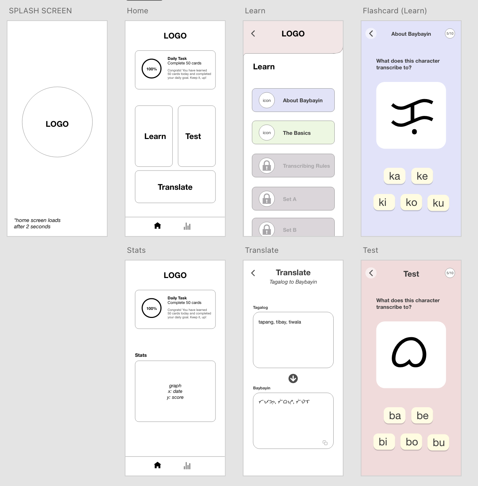
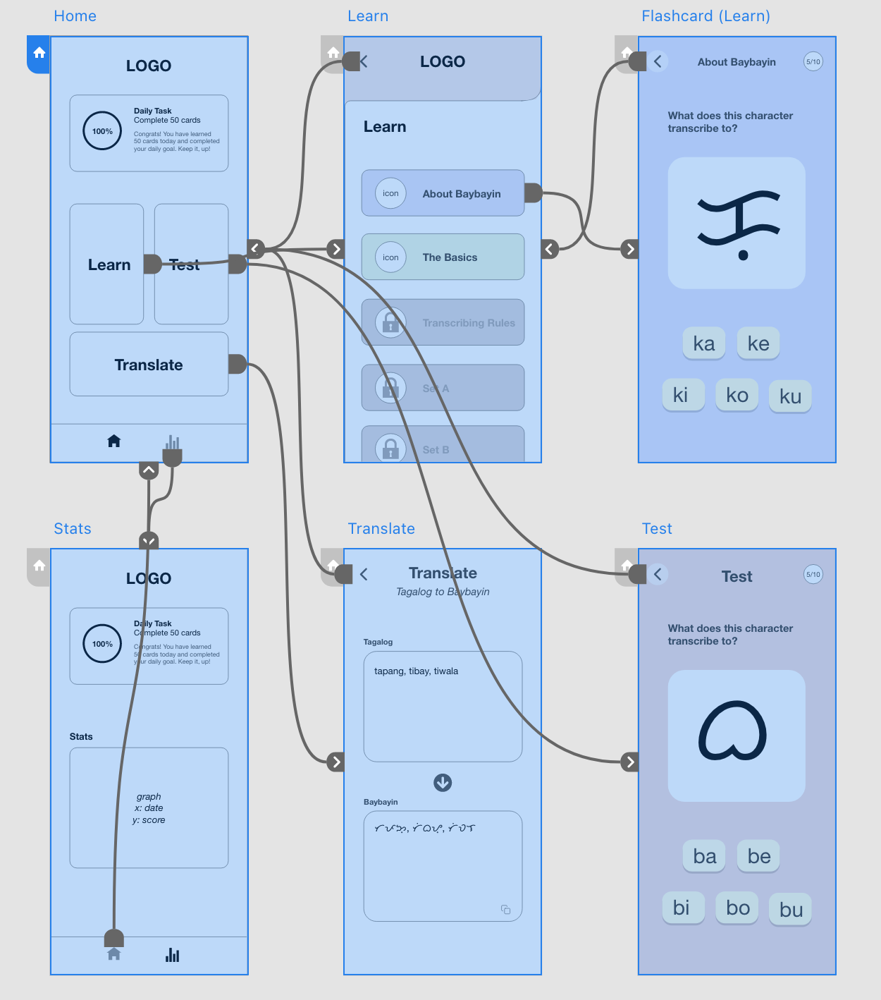

# CS IA | Baybai: a Baybayin script learning app


# Criteria A: Planning
## Problem Definition
Baybayin (ᜊᜌ᜔ᜊᜌᜒᜈ᜔) is one of the pre-colonial writing systems used by early Filipinos as the writing component of Tagalog (the national language of the Philippines). More than three centuries of Spanish colonization led to the replacement of Baybayin by the Latin alphabet. Up to this date, there’s only less than 1% of the population that can read or write Baybayin[1].

A Tagalog language teacher from a public high school in the Philippines aims to revive the ancient script and teach it to his students. Recognizing the prevalence of mobile phones among students, a dedicated app becomes crucial for out-of-class learning. The teacher would like an application that enhances memory recall and knowledge reinforcement through visual cues and active engagement. Thus, a flashcard-based learning environment and the option to save words or flashcards for later memorization will be utilized. The teacher would also like to track students’ consistency by setting custom daily learning goals, necessitating a feature to set and monitor users' flashcard reading targets for consistent learning. To address the challenge of individualized progress tracking in a shared learning environment, the app incorporates a secure login system. Anticipating students' struggle with real-world application due to Baybayin's limited usage and the absence of comprehensive references, the app includes a robust translator feature. Since there is no accessible Baybayin keyboard for students, the app enables users to copy translated text to their clipboard, ensuring practical use beyond the classroom. Furthermore, fostering a sense of community and collaborative learning, the app incorporates a social platform where users can interact, share insights, and collectively enhance their Baybayin proficiency.

*<a href="#ap-a">Refer to Appendix A for client interview proof</a>*

## Proposed Solution
The proposed solution to address the challenges faced by the teacher and students in learning Baybayin is a mobile application called 'Baybai'. The application gets it name from the root word of 'Baybayin' which is 'baybay' meaning 'to spell' and 'bai' a Filipino expression which means friend. 'Baybai' is designed to provide an accessible and engaging platform for learning the Baybayin script. Developed using Python and KivyMD and the database handled using SQLite, the app allows students to conveniently learn and practice Baybayin outside the classroom. It offers a comprehensive learning experience with flashcards. The app includes a translator feature that allows users to easily translate Tagalog words and phrases into Baybayin characters, facilitating practical application in real-life contexts. Furthermore, 'baybai' tracks and measures students' progress through a daily goal count, motivating them to strive for continuous improvement. With its user-friendly interface, comprehensive learning resources, and focus on consistency and growth, 'baybai' empowers students to revive and master the Baybayin script effectively.

## Rationale for Proposed Solution

**Mobile Application**
* Accessibility: According to the problem definition, mobile phones are the more prevalent and accessible gadgets among the client’s students. Mobile phones can also be accessed anytime, anywhere making it an on-the-go learning aid.

**Flashcards-Based Learning**
* Effective Learning Technique: Flashcards are known for their effectiveness in promoting active recall and spaced repetition, aiding in long-term retention and comprehension[^2]. 
* Visual and Engaging: Flashcards provide visual cues, helping students associate Baybayin characters with their meanings, making the learning process more engaging and memorable[^2].

**Python and Kivy**
* Cross-Platform Compatibility: Python, a versatile programming language, along with Kivy, a Python framework, allows for the development of cross-platform mobile applications, ensuring compatibility across various operating systems[^3],[^4].

**PyCharm**
* Python-Specific Support: PyCharm offers dedicated support for Python development, including syntax highlighting, code analysis, and refactoring tools, which contribute to the smooth development process and code quality[^5].

**SQLite**
* Efficient and Reliable: SQLite offers high-performance data storage and retrieval capabilities, ensuring smooth data management within the mobile application, including user progress tracking and storing translation data[^6].

## Design Statement
I will design and make a mobile application for a client who is a Tagalog teacher at a public high school in the Philippines. The application will allow users to learn Baybayin and have four main functionalities: flashcards, translator, save flashcards, and an online forum. It will be developed using the Python programming language, KivyMD, and the PyCharm Integrated Development Environment. It will take 12 weeks to make and will be evaluated according to the following success criteria.

## Success Criteria

| No | Success Criteria                                                                                                                                             | Problem                                                                                                                                                                                                                                                                     |
|----|--------------------------------------------------------------------------------------------------------------------------------------------------------------|-----------------------------------------------------------------------------------------------------------------------------------------------------------------------------------------------------------------------------------------------------------------------------|
| 1  | User progress will be kept independently using an encrypted login system.                                                                                    | “To address the challenge of individualized progress tracking in a shared learning environment, the app incorporates a secure login system.”                                                                                                                                |
| 2  | The app allows the user to set a daily goal of flashcards to be read. The app then keeps track of whether the user has reached that goal for the day or not.	 | “The teacher would like to track students’ consistency by setting custom daily learning goals, necessitating a feature to set and monitor users' flashcard reading targets for consistent learning.”                                                                        |
| 3  | The flashcards in Learning Mode shows Baybayin characters and when tapped, reveals the corresponding Tagalog translation.	                                    | “The teacher would like an application that enhances memory recall and knowledge reinforcement through visual cues and active engagement. Thus, a flashcard-based learning environment will be utilized for the application.”                                               |
| 4  | The app allows the user to 'star' or save a flashcard for later reference or memorization.                                                                   | “The teacher would like an application that enhances memory recall and knowledge reinforcement through visual cues and active engagement. Thus, a flashcard-based learning environment and the option to save words or flashcards for later memorization will be utilized.” |
| 5  | Users will be able to translate a Tagalog word to Baybayin script.                                                                                           | “Anticipating students' struggle with real-world application due to Baybayin's limited usage and the absence of comprehensive references, the app includes a robust translator feature.”                                                                                    |
| 6  | Users will be able to copy the Baybayin script to the clipboard.                                                                                             | “Since there is no accessible Baybayin keyboard for students, the app enables users to copy translated text to their clipboard, ensuring practical use beyond the classroom.”                                                                                               |
| 7  | App contains a social network or online forum so users can interact with other users who want to learn Baybayin.                                             | “Furthermore, fostering a sense of community and collaborative learning, the app incorporates a social platform where users can interact, share insights, and collectively enhance their Baybayin proficiency.”                                                             |
| 9  | Develop Translation function back-end.                                                                                                                       | Have a 'Translator' function that receives a Tagalog word, syllabicates the word based on Tagalog language guidelines, and translates and returns the word to Baybayin script.                                                                                              |
| 10 | Develop Translation Mode (front and back-end)                                                                                                                |                                                                                                                                                                                                                                                                             |

# Criteria B: Design
## Diagrams
### System Diagrams
### Wireframes

Figure 1. Draft of the application's user interface created on Adobe XD



Figure 2. Wireframe of the mobile application
### UML Diagram
### ER Diagram
### Flowcharts

## Record of Tasks
| Task No | Planned Action                                                                                                                                                                                                                                                                                                                                                                                                                                                                                 | Planned Outcome                                                                                                                                                                 | Time estimate | Target completion date | Criterion |
|---------|------------------------------------------------------------------------------------------------------------------------------------------------------------------------------------------------------------------------------------------------------------------------------------------------------------------------------------------------------------------------------------------------------------------------------------------------------------------------------------------------|---------------------------------------------------------------------------------------------------------------------------------------------------------------------------------|---------------|------------------------|-----------|
| 1       | Identify & interview the client                                                                                                                                                                                                                                                                                                                                                                                                                                                                |                                                                                                                                                                                 | 6 min         | Jun 9                  | A         |
| 2       | Write the context of the problem                                                                                                                                                                                                                                                                                                                                                                                                                                                               | Establish the problem identified in a clear and concise manner. The problem definition must include who the client is, what the client wants, and indicate a possible solution. | 15 min        | Jun 9                  | A         |
| 3       | Brainstorm and write a proposed solution for the problem. Rationalize this solution for the client.                                                                                                                                                                                                                                                                                                                                                                                            | Explain in a concise and clear manner the purpose of the project to the client                                                                                                  | 5 min         | Jun 9                  | A         |
| 4       | Write the success criteria of the proposed solution.                                                                                                                                                                                                                                                                                                                                                                                                                                           | A clear set standards to be met by the developer, that suits the client's needs and preferences.                                                                                | 15 min        | Jun 10                 | A         |
| 5       | Meet with the client to confirm or revise success criteria.                                                                                                                                                                                                                                                                                                                                                                                                                                    | Confirmed success criteria and ensure it meets the client's standards.                                                                                                          | 15 min        | Jun 10                 | A         |
| 6       | Write a design statement for the proposed solution 'spent.io'                                                                                                                                                                                                                                                                                                                                                                                                                                  | A coherent design statement that outlines the plan for the project.                                                                                                             | 20 min        | Jun 10                 | A         |
| 7       | Draw a system diagram for the proposed app solution: 'spent.io'                                                                                                                                                                                                                                                                                                                                                                                                                                | Have a concrete idea of the software and hardware requirements involved in the development of the application.                                                                  | 10 min        | Jun 10                 | B         |
| 8       | Plan & create the wireframe for the proposed solution: 'spent.io'. The wireframe includes 3 screens: Login Screen, Registration Screen, and Main Screen. This wireframe plan must include the widgets to be shown, components (ex. Dialog, MDButton), dimensions of each screens, components, and color schemes. This must also outline the transition from one screen to another and how this is done. More importantly, the planned wireframe must align with the client's success criteria. | Have a detailed visual representation of the project which also serves as a guide for the developer during the programming process.                                             | 60 min        | Jun 11                 | B         |
| 9       | Develop Translation function back-end.                                                                                                                                                                                                                                                                                                                                                                                                                                                         | Have a 'Translator' function that receives a Tagalog word, syllabicates the word based on Tagalog language guidelines, and translates and returns the word to Baybayin script.  | 80 min        | Jul 21                 | C         |
| 10      | Develop Translation Mode (front and back-end)                                                                                                                                                                                                                                                                                                                                                                                                                                                  |                                                                                                                                                                                 | 80 min        | Jul 22                 | C         |

## Test Plan
| Test No | Test Type                                                                                            | Date  | Procedure                                                                                                                                                                                                                                                                                                                                                                                                                                                                                                                                                                                                                                                                                                                                                                                                              | Expected Outcome                                                                                                                                                                                                                                                                                    |
|---------|------------------------------------------------------------------------------------------------------|-------|------------------------------------------------------------------------------------------------------------------------------------------------------------------------------------------------------------------------------------------------------------------------------------------------------------------------------------------------------------------------------------------------------------------------------------------------------------------------------------------------------------------------------------------------------------------------------------------------------------------------------------------------------------------------------------------------------------------------------------------------------------------------------------------------------------------------|-----------------------------------------------------------------------------------------------------------------------------------------------------------------------------------------------------------------------------------------------------------------------------------------------------| 
| 1       | Functional: Test  whether the SignUp screen succesfully registers new user if all entries are valid. | Oct 8 | Run python file (spentio.py). Go to sign up screen and enter the following values: <br/>- email: bob@isak<br/>- username: bob<br/>-password: bob123                                                                                                                                                                                                                                                                                                                                                                                                                                                                                                                                                                                                                                                                    | When the database, spentio.db is checked, a new row of data can be seen. This row shows the entered email, username, and password encrypted using a certain hash.                                                                                                                                   |
| 2       | Translation: Test the translation function.                                                          | Oct 8 | Using a Kaggle database from the University of the Philippines                                                                                                                                                                                                                                                                                                                                                                                                                                                                                                                                                                                                                                                                                                                                                                                                                       |                                                                                                                                                                                                                                                                                                     |

# Criteria C: Development
## Tools Used

## Explanation of Techniques and Evidence

### Registration System (Local Storage)
```pycon
class SignUpScreen(MDScreen):
    def login_screen(self):
        self.parent.current = "LoginScreen"

    def popup(self,out: str):
        self.dialog = MDDialog(text=out)
        self.dialog.open()

    def validate_register(self, uname: str, pass1: str, conpass: str):
        db = database_handler(namedb='baybai.db')
        popup_text = ""

        if uname in db.search(f"SELECT uname FROM users WHERE uname='{uname}'"):
            popup_text += f"Username [color=0000FF]{uname}[/color] already exists."
        elif len(pass1) <= 6:
            popup_text += "\nPassword needs to be longer than 6 characters."
        elif pass1 != conpass:
            popup_text += "\nPasswords don't match."
        else:
            return True

        popup_text += "\nPlease try again."
        db.close()
        self.popup(popup_text)
        return False

    def try_register(self):
        db = database_handler(namedb='baybai.db')
        db.run_query("""CREATE TABLE if not exists users(
                        id INTEGER primary key autoincrement,
                        name TEXT not null,
                        uname TEXT not null,
                        password TEXT not null);""")
        #TAKE ALL INPUTS, VALIDATE, AND APPEND TO DATABASE
        name,uname,pass1,con_pass = self.ids.name.text,self.ids.uname.text,self.ids.password.text,self.ids.confirm_password.text

        if self.validate_register(uname, pass1, con_pass):
            db.run_query(f"INSERT INTO USERS (name,uname,password) VALUES ('{name}','{uname}','{encrypt_password(pass1)}')")
            self.popup("[color=ACFF3C]Registration completed. Welcome![/color]")
            db.close()

            self.ids.name.text,self.ids.uname.text,self.ids.password.text,self.ids.confirm_password.text="","","",""
            current_user = uname
            self.parent.current = "HomeScreen"
    
    def clear_inputs(self):
        self.ids.name.text = ""
        self.ids.uname.text = ""
        self.ids.password.text = ""
        self.ids.confirm_password.text = ""
```

In this code snippet from the `SignUpScreen` class of the 'Baybai' application, several methods are defined to manage the user registration process. The 'login_screen' method (line 3) facilitates user navigation by allowing them to switch to the login screen if they already have an existing account. The 'popup' method (line 6-10) is responsible for generating and displaying pop-up dialogs, which provide crucial user feedback throughout the registration process.

The core functionality is encapsulated within the `validate_register` method (line 13-32). This method performs various checks to validate user-provided registration information. Firstly, it verifies if the entered username already exists in the database, alerting users if their chosen username is already in use. Secondly, it ensures that the password entered is at least 6 characters long, thus enforcing a minimum security threshold. Lastly, it compares the password and confirm password fields to confirm they match. If any of these checks fail, the method constructs an error message for the user. If all validations succeed, it returns 'True'; otherwise, it displays the relevant error messages in a pop-up dialog, guiding users to correct their input.

The 'try_register' method (line 35-55) manages the actual registration process. It begins by initializing a connection to the database, creating a 'users' table if it does not already exist. It then retrieves user input for name, username, password, and confirm password. If these inputs pass the validation checks carried out by the 'validate_register' method, the user's password is securely hashed before being inserted into the 'users' table in the database. Following a successful registration, users receive a pop-up dialog with a message confirming their registration and are then presented with cleared input fields to facilitate a seamless experience.

The 'clear_inputs' method (line 58-62) serves the purpose of resetting all input fields on the registration screen, simplifying the correction of erroneous inputs by users. This code follows best practices in coding, including clear and meaningful method and variable naming, error handling, and the use of pop-up dialogs to provide valuable feedback to users during the registration process.

# Appendix
## <a id="ap-a"> Appendix A. Client Interview </a>


# Sources
[^1]: https://kinsta.com/mobile-vs-desktop-market-share/#:~:text=To%20look%20at%20a%20similar,%2C%20and%202%25%20from%20tablet.
[^2]: https://onlinelibrary.wiley.com/doi/abs/10.1002/acp.1537
[^3]: https://www.researchgate.net/publication/274572185_Comparative_Studies_of_Six_Programming_Languages
[^4]: https://kivy.org/
[^5]: https://www.jetbrains.com/pycharm/
[^6]: https://www.sqlite.org/inmemorydb.html

