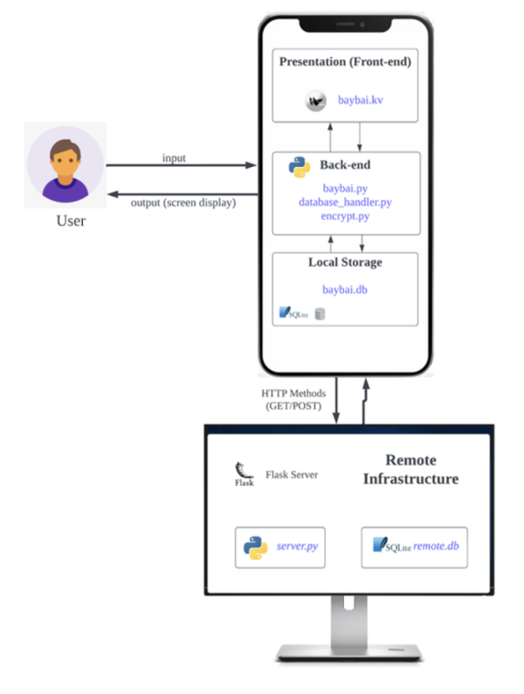
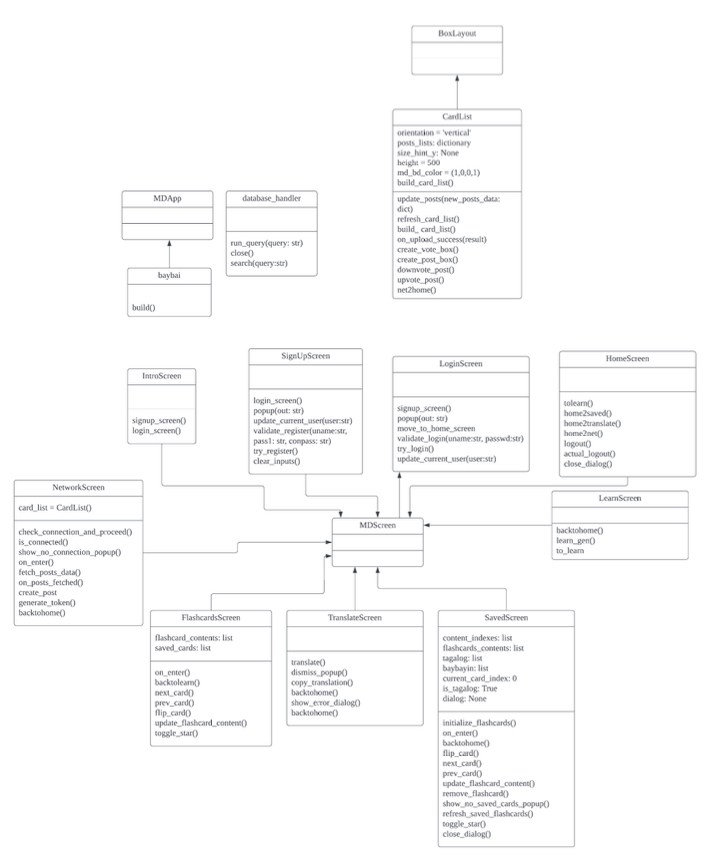
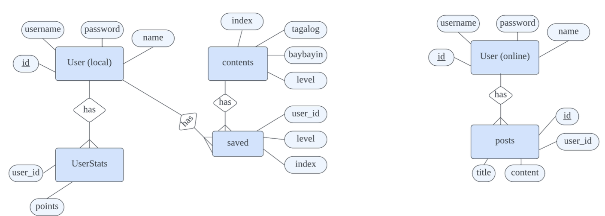

# Baybai - Baybayin Script Learning App
*This project was submitted as part of the requirements for completion for Computer Science HL May 2024 for the International Baccalaureate Diploma. Ma*

Baybai is a mobile application designed to teach and revive **Baybayin**, the pre-colonial writing system of the Philippines. The app provides a comprehensive learning experience for students and enthusiasts of the Baybayin script, featuring flashcards, a translator, and a social network for collaborative learning. The application was developed using Python, KivyMD, and SQLite.

## Problem Definition
Baybayin, a pre-colonial script used by early Filipinos, has largely been replaced by the Latin alphabet due to over three centuries of Spanish colonization. Today, fewer than 1% of Filipinos can read or write Baybayin, creating challenges for its revival in modern education.

A Filipino high school teacher aims to teach Baybayin to students but faces several challenges:
- Limited resources for learning the script
- The absence of a widely accessible Baybayin keyboard
- Struggles with real-world application due to Baybayin’s limited use in modern contexts

## Proposed Solution
The solution is **Baybai**, a mobile application that provides an accessible and engaging platform for learning Baybayin. The app features:
- **Flashcards**: For learning and memorizing Baybayin characters
- **Translator**: A tool for converting Tagalog words and phrases into Baybayin script
- **Social Network**: A platform for collaborative learning and community support

## Features
1. **User Progress Tracking**: A personalized system that tracks the user’s learning journey with an encrypted login system.
2. **Flashcards**: Visual cues for active recall, showing Baybayin characters and their corresponding Tagalog translations.
3. **Translation Tool**: Enables transcription of Tagalog words into Baybayin script.
4. **Clipboard Copy**: Users can copy transcribed Baybayin script to their clipboard for use in other platforms.
5. **Saved Flashcards**: Users can save flashcards for later review and memorization.
6. **Online Forum**: Users can interact with others learning Baybayin, fostering collective learning and discussion.

## Technology Stack
- **Programming Language**: Python
- **Frameworks**: KivyMD, Flask
- **Database**: SQLite
- **IDE**: PyCharm

## Development Techniques
The development of the Baybai app used the following coding techniques:
- **Object-Oriented Programming (OOP)**: Used to structure screens and functions of the app, encapsulating properties and methods for each segment.
- **Flask App Routing**: Handled server-side URLs for authentication, data retrieval, and user posts.
- **JWT Tokens**: Implemented for secure, authenticated communication between the app and server.
- **HTTP Methods (GET and POST)**: Managed user actions such as fetching posts and sending data.
- **Password Encryption**: User passwords are securely hashed before database storage.
- **Kivy Widgets**: Enhanced the user interface through widget management and rendering.
- **Dynamic Content Loading**: Flashcards are dynamically updated based on the user’s interactions.
- **Clipboard Operations**: Integrated pyperclip to allow easy copying of Baybayin transcriptions.

[See more detailed development techniques](docs/development.md).

## System Design

### System Diagram

_The system architecture of the Baybai mobile app._

### UML Diagram

_Classes and methods used to build the Baybai app._

### ER Diagram

_Database structure showcasing relationships between the user and posts tables._

### Flowcharts
- **Save Card Algorithm**: A flowchart depicting the functionality of saving cards.
  
- **Transcription Algorithm**: This flowchart details the translation process within the app.
  
- **Copy Transcription Algorithm**: A flowchart showing how users copy Baybayin translations.
  

## Success Criteria
| #  | Success Criteria                                          | Problem Addressed                                                                                     |
|----|-----------------------------------------------------------|-------------------------------------------------------------------------------------------------------|
| 1  | User progress tracking with an encrypted login system      | Individualizing instruction in large classes is challenging.                                           |
| 2  | Flashcards showing Baybayin characters and Tagalog words   | Lack of adequate and engaging resources for learning the script.                                       |
| 3  | Transcription of Tagalog words into Baybayin script        | Real-world application is limited due to the script’s disuse.                                          |
| 4  | Ability to copy transcribed Baybayin script                | Lack of keyboard support for Baybayin across platforms.                                                |
| 5  | Flashcards can be saved for later reference                | Enhancing memory recall outside the classroom is challenging.                                          |
| 6  | Online forum for collaborative learning                    | Difficulty in sharing insights and collectively enhancing proficiency.                                 |

## Evaluation

Upon project completion, a client questionnaire confirmed the following success criteria were met:

1. **Encrypted Login System**: Users can securely log in and track their progress.
2. **Flashcards**: Tapping on flashcards reveals Baybayin characters and their Tagalog translations.
3. **Baybayin Transcription**: Users can transcribe Tagalog words accurately but multi-sentence transcription remains limited.
4. **Clipboard Copy**: Users can copy transcribed words to the clipboard for use in other platforms.
5. **Saved Flashcards**: Users can save flashcards by toggling a 'star' icon and retrieve them later.
6. **Online Forum**: Users can create posts with timestamps and usernames displayed.

### Recommendations for Future Improvements
- **UI Enhancements**: Improvements to the social network’s interface to better handle post overflow and scrolling issues.
- **New Features**: Add functionalities like liking/unliking posts, commenting, saving posts, and uploading images.
- **Multi-Sentence Transcription**: Improve the transcription feature to handle full sentences.

## Contributors
- **Zelan Eroz Espanto** - Lead Developer
