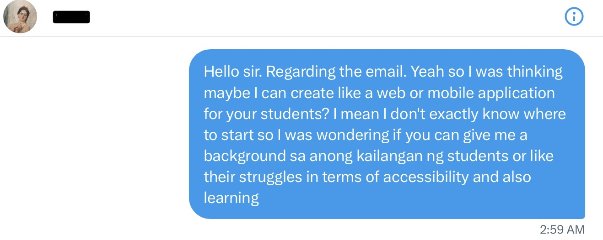

# CS IA | Baybai: a Baybayin script learning app

# Criteria A: Planning
## Problem Definition
Baybayin (ᜊᜌ᜔ᜊᜌᜒᜈ᜔) is one of the precolonial writing systems used by early Filipinos as the writing component of Tagalog (national language). More than three centuries of Spanish colonization led to the replacement of Baybayin by the Latin alphabet.

A teacher in a public high school in the Philippines aims to revive Baybayin by teaching the script to his students. Given that teaching Baybayin is not part of the curriculum and therefore is not allotted time, learning outside of class is vital. The client has tried to implement such kind of learning through homeworks, and a list of links of references but all to no avail. To add, internet and desktop access pose challenges as they are not readily available due to the costs associated with mobile data plans, Wi-Fi, and laptops. Students struggle to retain the script outside the classroom, given its limited usage outside a specific niche. The teacher emphasizes the importance of consistency in learning Baybayin, highlighting the need for an app that encourages regular practice. Additionally, a translator feature is essential for students to apply the script in real-life contexts. Furthermore, like any language, growth (through objective assessment) and consistent practice involving writing and memorizing characters are crucial for effective learning.

## Proposed Solution
The proposed solution to address the challenges faced by the teacher and students in learning Baybayin is a mobile application called 'baybai'. 'baybai' is designed to provide an accessible and engaging platform for learning the Baybayin script. Developed using Python and KivyMD, the app allows students to conveniently learn and practice Baybayin outside the classroom. It offers a comprehensive learning experience with interactive lessons, flashcards, and writing practice exercises. The app incorporates a spaced repetition system to ensure optimal retention and growth in learning. To address the limitations of internet and desktop access, 'baybai' operates offline, enabling students to learn without relying on costly data plans or Wi-Fi. The app includes a translator feature that allows users to easily translate Tagalog words and phrases into Baybayin characters, facilitating practical application in real-life contexts. Furthermore, 'baybai' tracks and measures students' progress through objective assessments, providing them with a clear understanding of their proficiency level and motivating them to strive for continuous improvement. With its user-friendly interface, comprehensive learning resources, and focus on consistency and growth, 'baybai' empowers students to revive and master the Baybayin script effectively.

## Rationale for Proposed Solution

**Mobile Application**
* Accessibility: A mobile application ensures widespread accessibility for students, as mobile phones are the most accessible gadgets for them, considering factors like cost and availability of internet access[^1].
* Portability: Students can conveniently learn Baybayin anytime and anywhere using their smartphones, making it a flexible and on-the-go learning solution.

**Flashcards-Based Learning**
* Effective Learning Technique: Flashcards are known for their effectiveness in promoting active recall and spaced repetition, aiding in long-term retention and comprehension (source: Association for Psychological Science).
* Visual and Engaging: Flashcards provide visual cues, helping students associate Baybayin characters with their meanings, making the learning process more engaging and memorable.

**Python and Kivy**
* Cross-Platform Compatibility: Python, a versatile programming language, along with Kivy, a Python framework, allows for the development of cross-platform mobile applications, ensuring compatibility across various operating systems (source: Kivy documentation).
* Easy to Learn and Use: Python's simple syntax and extensive libraries make it an ideal choice for developing mobile applications, while Kivy simplifies the process of building user interfaces and handling touch events (source: Python Software Foundation).

**PyCharm**
* Integrated Development Environment (IDE): PyCharm provides a powerful and user-friendly development environment for Python, offering features like code completion, debugging tools, and version control integration, enhancing productivity and facilitating efficient app development (source: JetBrains).
* Python-Specific Support: PyCharm offers dedicated support for Python development, including syntax highlighting, code analysis, and refactoring tools, which contribute to the smooth development process and code quality.

**SQLite**
* Lightweight and Embedded Database: SQLite, being a self-contained database engine, allows for seamless integration within the mobile application without requiring separate installations or server configurations (source: SQLite website).
* Efficient and Reliable: SQLite offers high-performance data storage and retrieval capabilities, ensuring smooth data management within the mobile application, including user progress tracking and storing translation data (source: SQLite documentation).

## Design Statement
I will design and make a mobile application for a client who is a Tagalog teacher at a public high school in the Philippines. The application will allow users to learn Baybayin and have three main functionalities: learning mode, test mode, and translator. It will be developed using the Python programming language, KivyMD, and the PyCharm Integrated Development Environment. It will take 4 weeks to make and will be evaluated according to the following success criteria.

## Success Criteria

 No. | Success Criteria                                                                                                                                                               | Issue Tackled                                                                                                                                                    |
-----|--------------------------------------------------------------------------------------------------------------------------------------------------------------------------------|------------------------------------------------------------------------------------------------------------------------------------------------------------------|
 1   | The solution is a mobile application that's accessible offline and provides a way for users to learn Baybayin using flashcards based on spaced repetition.                     | "However, internet and desktop access pose challenges as they are not readily available due to the costs associated with mobile data plans, Wi-Fi, and laptops." |
| 2   | The app keeps track of the user's streaks and highest user streak to encourage consistency.                                                                                    | "...highlighting the need for an app that encourages regular practice."                                                                                          |
| 3   | The flashcards for learning mode enable writing/stroke practice and shows Baybayin characters and its corresponding Tagalog translation.                                       | "...consistent practice involving writing and memorizing characters is crucial for effective learning."                                                          |                                                                                                                                                                
| 4   | The Test Mode will assess users' knowledge and proficiency in Baybayin. It will generate random Tagalog words, challenging users to type in the corresponding Baybayin script. | "...growth (through objective assessment)...are crucial for effective learning."                                                                                 |
| 5   | The application will record users' scores on Test Mode and visually present their performance, allowing them to track their progress over time.                                |"...growth (through objective assessment)...are crucial for effective learning."                                 |
| 6   | The app enables Tagalog to Baybayin translation and allows the user to copy the Baybayin characters to their clipboard.                                                        | "It's important for students to have a translator to apply the script in real-life context."                                                                     |

# Criteria B: Design
## Diagrams
### System Diagrams
### Wireframes
### UML Diagram
### ER Diagram
### Flowcharts

## Record of Tasks
| Task No | Planned Action                                                                                                                                                                                                                                                                                                                                                                                                                                                                                 | Planned Outcome                                                                                                                                                                                                                                                                                                                                                                                     | Time estimate | Target completion date | Criterion |
|---------|------------------------------------------------------------------------------------------------------------------------------------------------------------------------------------------------------------------------------------------------------------------------------------------------------------------------------------------------------------------------------------------------------------------------------------------------------------------------------------------------|-----------------------------------------------------------------------------------------------------------------------------------------------------------------------------------------------------------------------------------------------------------------------------------------------------------------------------------------------------------------------------------------------------|---------------|------------------------|-----------|
| 1       | Identify & interview the client                                                                                                                                                                                                                                                                                                                                                                                                                                                                |                                                                                                                                                                                                                                                                                                                                                                                                     | 6 min         | Feb 9                  | A         |
| 2       | Write the context of the problem                                                                                                                                                                                                                                                                                                                                                                                                                                                               | Establish the problem identified in a clear and concise manner. The problem definition must include who the client is, what the client wants, and indicate a possible solution.                                                                                                                                                                                                                     | 15 min        | Feb 9                  | A         |
| 3       | Brainstorm and write a proposed solution for the problem. Rationalize this solution for the client.                                                                                                                                                                                                                                                                                                                                                                                            | Explain in a concise and clear manner the purpose of the project to the client                                                                                                                                                                                                                                                                                                                      | 5 min         | Feb 9                  | A         |
| 4       | Write the success criteria of the proposed solution.                                                                                                                                                                                                                                                                                                                                                                                                                                           | A clear set standards to be met by the developer, that suits the client's needs and preferences.                                                                                                                                                                                                                                                                                                    | 15 min        | Feb 10                 | A         |
| 5       | Meet with the client to confirm or revise success criteria.                                                                                                                                                                                                                                                                                                                                                                                                                                    | Confirmed success criteria and ensure it meets the client's standards.                                                                                                                                                                                                                                                                                                                              | 15 min        | Feb 10                 | A         |
| 6       | Write a design statement for the proposed solution 'spent.io'                                                                                                                                                                                                                                                                                                                                                                                                                                  | A coherent design statement that outlines the plan for the project.                                                                                                                                                                                                                                                                                                                                 | 20 min        | Feb 10                 | A         |
| 7       | Draw a system diagram for the proposed app solution: 'spent.io'                                                                                                                                                                                                                                                                                                                                                                                                                                | Have a concrete idea of the software and hardware requirements involved in the development of the application.                                                                                                                                                                                                                                                                                      | 10 min        | Feb 10                 | B         |
| 8       | Plan & create the wireframe for the proposed solution: 'spent.io'. The wireframe includes 3 screens: Login Screen, Registration Screen, and Main Screen. This wireframe plan must include the widgets to be shown, components (ex. Dialog, MDButton), dimensions of each screens, components, and color schemes. This must also outline the transition from one screen to another and how this is done. More importantly, the planned wireframe must align with the client's success criteria. | Have a detailed visual representation of the project which also serves as a guide for the developer during the programming process.                                                                                                                                                                                                                                                                 | 60 min        | Feb 11                 | B         |

## Test Plan
| Test No | Test Type                                                                                            | Date   | Procedure                                                                                                                                                                                                                                                                                                                                                                                                                                                                                                                                                                                                                                                                                                                                                                                                              | Expected Outcome                                                                                                                                                                                                                                                                                    |
|---------|------------------------------------------------------------------------------------------------------|--------|------------------------------------------------------------------------------------------------------------------------------------------------------------------------------------------------------------------------------------------------------------------------------------------------------------------------------------------------------------------------------------------------------------------------------------------------------------------------------------------------------------------------------------------------------------------------------------------------------------------------------------------------------------------------------------------------------------------------------------------------------------------------------------------------------------------------|-----------------------------------------------------------------------------------------------------------------------------------------------------------------------------------------------------------------------------------------------------------------------------------------------------| 
| 1       | Functional: Test  whether the SignUp screen succesfully registers new user if all entries are valid. | Feb 18 | Run python file (spentio.py). Go to sign up screen and enter the following values:  - email: bob@isak - username: bob -password: bob123                                                                                                                                                                                                                                                                                                                                                                                                                                                                                                                                                                                                                                                                    | When the database, spentio.db is checked, a new row of data can be seen. This row shows the entered email, username, and password encrypted using a certain hash.                                                                                                                                   |

# Appendix
## <a id="ap-a"> Appendix A. Client Interview </a>

# Sources
[^1]: https://kinsta.com/mobile-vs-desktop-market-share/#:~:text=To%20look%20at%20a%20similar,%2C%20and%202%25%20from%20tablet.

